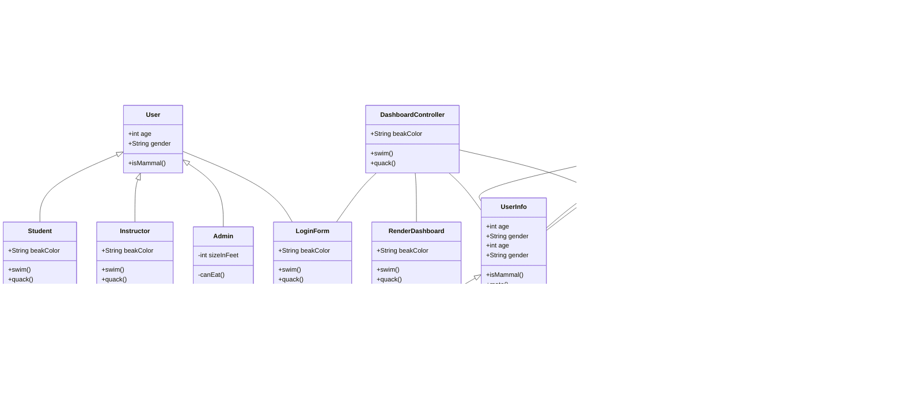

```mermaid
classDiagram


User <|-- Student
User <|-- Instructor
User <|-- Admin


User -- LoginForm

DashboardController -- LoginForm
DashboardController -- RenderDashboard
DashboardController -- UserInfo
DashboardController -- Stage


CourseMaterials -- Stage
Assignment -- Stage
Puzzles -- Stage

DataElement <|-- UserInfo
DataElement <|-- CourseMaterials
DataElement <|-- Assignment
DataElement <|-- Puzzles
DataElement <|-- UserInfo

UserInfo <|-- StudentInfo
UserInfo <|-- InstructorInfo
UserInfo <|-- AdminInfo


Database -- DataElement

class User{
+int age
+String gender
+isMammal()
}

class Student{
+String beakColor
+swim()
+quack()
}

class Instructor{
+String beakColor
+swim()
+quack()
}

class Admin{
-int sizeInFeet
-canEat()
}


class LoginForm{
+String beakColor
+swim()
+quack()
}


class RenderDashboard{
+String beakColor
+swim()
+quack()
}


class DashboardController{
+String beakColor
+swim()
+quack()
}


class UserInfo{
+int age
+String gender
+isMammal()
+mate()
}

class UserInfo{
+int age
+String gender
+isMammal()
+mate()
}


class StudentInfo{
+int age
+String gender
+isMammal()
+mate()
}


class InstructorInfo{
+int age
+String gender
+isMammal()
+mate()
}


class AdminInfo{
+int age
+String gender
+isMammal()
+mate()
}


class Stage{
+int age
+String gender
+isMammal()
}


class CourseMaterials{
+int age
+String gender
+isMammal()
+mate()
}

class Puzzles{
+int age
+String gender
+isMammal()
+mate()
}

class Assignment{
+int age
+String gender
+isMammal()
+mate()
}


class DataElement{
+int age
+String gender
+isMammal()
+mate()
}


DataElement <|-- CourseMaterials
DataElement <|-- Assignment
DataElement <|-- Puzzles
DataElement <|-- UserInfo

class Database{
+int age
+String gender
+isMammal()
+mate()
}
```
