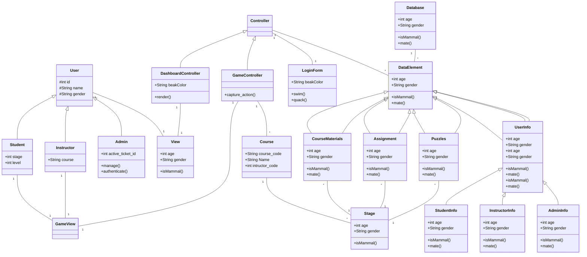

```mermaid
classDiagram


User <|-- Student
User <|-- Instructor
User <|-- Admin


User "1"--"1" View

Student "1"--"1" GameView
Instructor "1"--"1" GameView

GameController "1"--"1" GameView

Controller <|-- GameController
Controller <|-- DashboardController

DashboardController "1"--"1" View
Controller "1"--"1" LoginForm
Controller "1"--"*" DataElement
GameController "1"--"*" Course


Course "1"--"*" Stage
CourseMaterials "*"--"1" Stage
Assignment "*"--"1" Stage
Puzzles "*"--"1" Stage

DataElement <|-- UserInfo
DataElement <|-- CourseMaterials
DataElement <|-- Assignment
DataElement <|-- Puzzles
DataElement <|-- UserInfo

UserInfo <|-- StudentInfo
UserInfo <|-- InstructorInfo
UserInfo <|-- AdminInfo


Database "1"--"*" DataElement

class User{
#int id
#String name
#String gender
}

class Student{
+int stage
+int level
}

class Instructor{
+String course
}

class Admin{
+int active_ticket_id
+manage()
+authenticate()
}


class LoginForm{
+String beakColor
+swim()
+quack()
}


class View{
+int age
+String gender
+isMammal()
}


class DashboardController{
+String beakColor
+render()
}

class GameController{
+capture_action()
}

class UserInfo{
+int age
+String gender
+isMammal()
+mate()
}

class UserInfo{
+int age
+String gender
+isMammal()
+mate()
}


class StudentInfo{
+int age
+String gender
+isMammal()
+mate()
}


class InstructorInfo{
+int age
+String gender
+isMammal()
+mate()
}


class AdminInfo{
+int age
+String gender
+isMammal()
+mate()
}

class Course{
+String course_code
+String Name
+int intructor_code
}


class Stage{
+int age
+String gender
+isMammal()
}


class CourseMaterials{
+int age
+String gender
+isMammal()
+mate()
}

class Puzzles{
+int age
+String gender
+isMammal()
+mate()
}

class Assignment{
+int age
+String gender
+isMammal()
+mate()
}


class DataElement{
+int age
+String gender
+isMammal()
+mate()
}


DataElement <|-- CourseMaterials
DataElement <|-- Assignment
DataElement <|-- Puzzles
DataElement <|-- UserInfo

class Database{
+int age
+String gender
+isMammal()
+mate()
}
```
