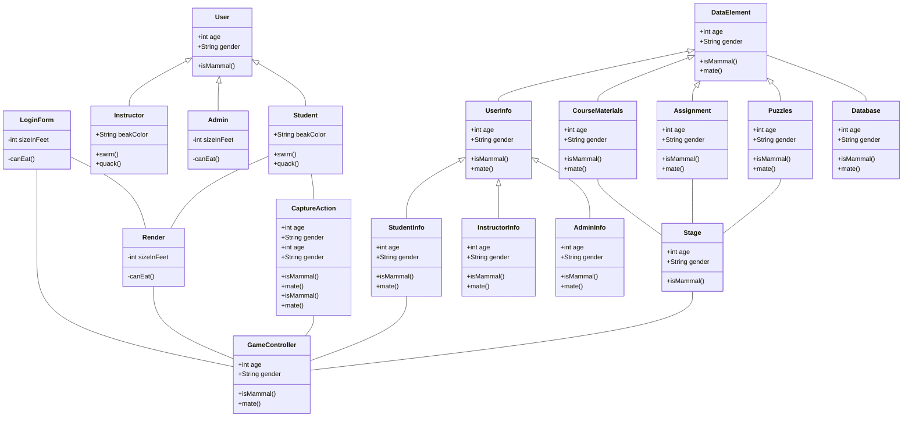

```mermaid
classDiagram

User <|-- Student
User <|-- Instructor
User <|-- Admin


LoginForm -- Render


Student -- Render
Student -- CaptureAction

LoginForm -- GameController
Render -- GameController
CaptureAction -- GameController
StudentInfo -- GameController
Stage -- GameController

CourseMaterials -- Stage
Assignment -- Stage
Puzzles -- Stage

DataElement <|-- CourseMaterials
DataElement <|-- Assignment
DataElement <|-- Puzzles
DataElement <|-- UserInfo

UserInfo <|-- StudentInfo
UserInfo <|-- InstructorInfo
UserInfo <|-- AdminInfo

DataElement -- Database


class User{
+int age
+String gender
+isMammal()
}

class Student{
+String beakColor
+swim()
+quack()
}

class Instructor{
+String beakColor
+swim()
+quack()
}

class Admin{
-int sizeInFeet
-canEat()
}


class LoginForm{
-int sizeInFeet
-canEat()
}

class Render{
-int sizeInFeet
-canEat()
}


class CaptureAction{
+int age
+String gender
+isMammal()
+mate()
}


class CaptureAction{
+int age
+String gender
+isMammal()
+mate()
}


class GameController{
+int age
+String gender
+isMammal()
+mate()
}


class Stage{
+int age
+String gender
+isMammal()
}


class CourseMaterials{
+int age
+String gender
+isMammal()
+mate()
}

class Puzzles{
+int age
+String gender
+isMammal()
+mate()
}

class Assignment{
+int age
+String gender
+isMammal()
+mate()
}


class UserInfo{
+int age
+String gender
+isMammal()
+mate()
}


class StudentInfo{
+int age
+String gender
+isMammal()
+mate()
}


class InstructorInfo{
+int age
+String gender
+isMammal()
+mate()
}


class AdminInfo{
+int age
+String gender
+isMammal()
+mate()
}


class DataElement{
+int age
+String gender
+isMammal()
+mate()
}


class Database{
+int age
+String gender
+isMammal()
+mate()
}


```

