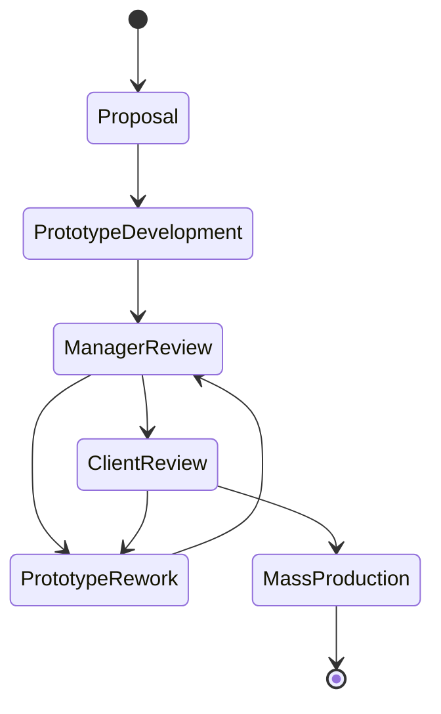

# cse608-assignments
* Assignment 1 [planetuml link](http://www.plantuml.com/plantuml/uml/VPBTxjiW3CNlUGghztc5gLkhIPCsQLgxwya19qKZWB3fb7sy-o2XQNFplygn_JkAEN1amIHvSihH8201aXrl0iOcqcA3LmgrX0JVcH8WGoxVH-_aB7cfNUsKYgX_uaXm4Ho6skGg_YY0bJvyJS5aBV05VU7IeJBJDZuJsz6lFp5FqpN4DceE2V5bVCeiOIgk2wMxrRGWcf_0XyniFJ43UdGpoqBqgFvj2r_3_76XPwZRPYQDJ73u74Rh5pp_S5Mhr-abzvCLY2d4mEWQnt47dUdkGhH-1BbHOybK8K7cICrbzgvlTBVqwsrBsbjAjjbe0f0mSqEYx91FNYYX5a1lO2I1WSZq9OE6ZyCEVr_Z-atGvpM_Hc5Ve1BUShdGrLVJ_NstFWljeCjnArMzAkXgRPIghL9iMHPwBJbkigoWUPCFVmkeoNggQPKbWnvNMTOwaZTvSly1) 
* Assignment1 [online word report](https://engasuedu-my.sharepoint.com/:w:/g/personal/2101398_eng_asu_edu_eg/EW6_-ZXMwapFrVV4nNACJHMBJjRv74BawB33d8nUSPfVcA?e=F5bwLm)

# Assignment 1 Description  (Thanks to ALLAH)[DONE]
A factory produces kids toys. the process of production depending on **getting a proposal** and **developing a prototype** and finally **produce the toys** and **getting feedback from the client**. **a top designer do the proposed prototype**. that usually **reviewed by a product manager**. **The business of the factory business needs to be automated** and also **the amount of sales and feedback related to toys needs analysis** and **Business analytics**.

* The toy factory has:
1. number of toy designers. 
2. product managers.
3. customer service who interact with client to propose toys and get feedback.

## Requirements:
1. create a detailed USE case diagram and make all possible assumptions

2. write the detailed use case description for two use cases 

3. create a at least 10 INVEST user stories, and put them in a diagram value-vs-difficulty

* **provide neat diagrams and make reasonable assumptions**

4. work in a team of two or individuals.

## Project State Diagram

**It is required to build a software application in one of the following domains:**

## 3. Virtual Reality Educational Game
* Virtual Reality Educational game based on topics from one course,
* students have **levels** 
* The course is divided into stages 
* Each student must complete all stages before he proceed to the final stage
* The course stages can be edited and updated by course instructors

## Team members
In teams of 1/2/3 create the following

## Requirements

1. userstories
2. functional and non functional requirements 
3. list all stakeholders
4. use case diagram
4. provide use case description for at least **two use cases**
5. create all required development uml models like:
* class diagram 
* time sequence diagram 
* state diagram
6. provide short research about the main system users UX 
* and design at least two UI screens

## What to hand
1. A word document containing all text diagrams, models and 
2. A presentation in ppt.pptx similar to the library case study
3. Possibly use draw.io for your **diagrams either copy and past or have link for the diagram in your word document**
