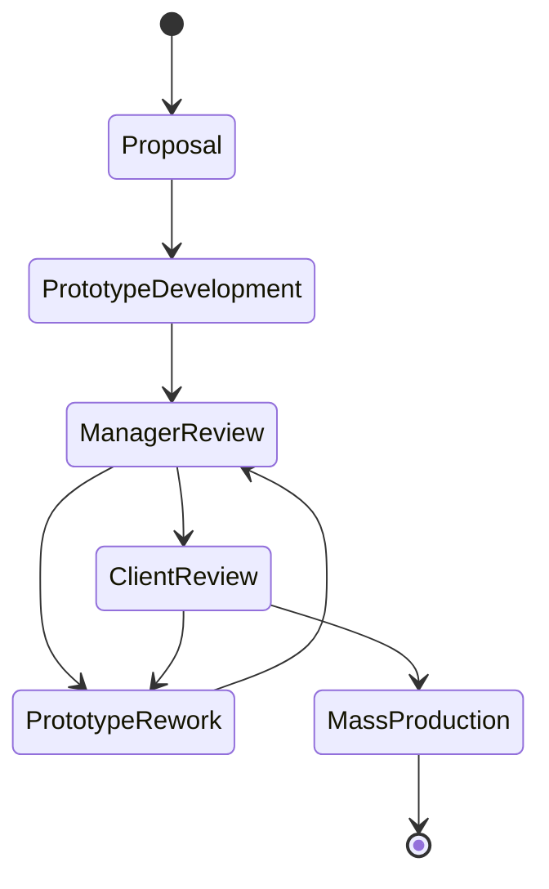

# cse608-assignments
* Assignment 1 [planetuml link](http://www.plantuml.com/plantuml/uml/VPBTxjiW3CNlUGghztc5gLkhIPCsQLgxwya19qKZWB3fb7sy-o2XQNFplygn_JkAEN1amIHvSihH8201aXrl0iOcqcA3LmgrX0JVcH8WGoxVH-_aB7cfNUsKYgX_uaXm4Ho6skGg_YY0bJvyJS5aBV05VU7IeJBJDZuJsz6lFp5FqpN4DceE2V5bVCeiOIgk2wMxrRGWcf_0XyniFJ43UdGpoqBqgFvj2r_3_76XPwZRPYQDJ73u74Rh5pp_S5Mhr-abzvCLY2d4mEWQnt47dUdkGhH-1BbHOybK8K7cICrbzgvlTBVqwsrBsbjAjjbe0f0mSqEYx91FNYYX5a1lO2I1WSZq9OE6ZyCEVr_Z-atGvpM_Hc5Ve1BUShdGrLVJ_NstFWljeCjnArMzAkXgRPIghL9iMHPwBJbkigoWUPCFVmkeoNggQPKbWnvNMTOwaZTvSly1) 
* Assignment1 [online word report](https://engasuedu-my.sharepoint.com/:w:/g/personal/2101398_eng_asu_edu_eg/EW6_-ZXMwapFrVV4nNACJHMBJjRv74BawB33d8nUSPfVcA?e=F5bwLm)

# Assignment 1 Description  (Thanks to ALLAH)[DONE]
A factory produces kids toys. the process of production depending on **getting a proposal** and **developing a prototype** and finally **produce the toys** and **getting feedback from the client**. **a top designer do the proposed prototype**. that usually **reviewed by a product manager**. **The business of the factory business needs to be automated** and also **the amount of sales and feedback related to toys needs analysis** and **Business analytics**.

* The toy factory has:
1. number of toy designers. 
2. product managers.
3. customer service who interact with client to propose toys and get feedback.

## Requirements:
1. create a detailed USE case diagram and make all possible assumptions

2. write the detailed use case description for two use cases 

3. create a at least 10 INVEST user stories, and put them in a diagram value-vs-difficulty

* **provide neat diagrams and make reasonable assumptions**

4. work in a team of two or individuals.

## Project State Diagram

## [ClassDiagram link](https://mermaid.live/view/#eyJjb2RlIjoiY2xhc3NEaWFncmFtXG5cblVzZXIgPHwtLSBTdHVkZW50XG5Vc2VyIDx8LS0gSW5zdHJ1Y3RvclxuVXNlciA8fC0tIEFkbWluXG5cblVzZXIgXCIxXCItLVwiMVwiIERhc2hib2FyZFZpZXdcbkRhc2hib2FyZENvbnRyb2xsZXIgXCIxXCItLVwiMVwiIERhc2hib2FyZFZpZXdcblxuU3R1ZGVudCBcIjFcIi0tXCIxXCIgR2FtZVZpZXdcblxuR2FtZUNvbnRyb2xsZXIgXCIxXCItLVwiMVwiIEdhbWVWaWV3XG5cbkNvbnRyb2xsZXIgPHwtLSBMb2dpbkNvbnRyb2xsZXJcbkNvbnRyb2xsZXIgPHwtLSBHYW1lQ29udHJvbGxlclxuQ29udHJvbGxlciA8fC0tIERhc2hib2FyZENvbnRyb2xsZXJcbkRhdGFFbGVtZW50IDx8LS0gQ291cnNlXG5cblVzZXIgXCIxXCItLVwiMVwiIExvZ2luRm9ybVxuTG9naW5Gb3JtIFwiMVwiLS1cIjFcIiBMb2dpbkNvbnRyb2xsZXIgXG5Db250cm9sbGVyIFwiMVwiLS1cIipcIiBEYXRhRWxlbWVudFxuXG5Db3Vyc2UgXCIxXCItLVwiKlwiIFN0YWdlXG5TdGFnZU1hdGVyaWFsIFwiKlwiLS1cIjFcIiBTdGFnZVxuUHV6emxlcyBcIipcIi0tXCIxXCIgU3RhZ2VcblxuVXNlckluZm8gPHwtLSBTdHVkZW50SW5mb1xuVXNlckluZm8gPHwtLSBJbnN0cnVjdG9ySW5mb1xuVXNlckluZm8gPHwtLSBBZG1pbkluZm9cblxuRGF0YWJhc2UgXCIxXCItLVwiKlwiIERhdGFFbGVtZW50XG5EYXRhRWxlbWVudCA8fC0tIFN0YWdlTWF0ZXJpYWxcbkRhdGFFbGVtZW50IDx8LS0gUHV6emxlc1xuRGF0YUVsZW1lbnQgPHwtLSBVc2VySW5mb1xuXG5EYXNoYm9hcmRDb250cm9sbGVyIDx8LS0gU3R1ZGVudERhc2hib2FyZENvbnRyb2xsZXJcbkRhc2hib2FyZENvbnRyb2xsZXIgPHwtLSBJbnN0cnVjdG9yRGFzaGJvYXJkQ29udHJvbGxlclxuXG5jbGFzcyBVc2Vye1xuK2dldFVzZXJJRCgpXG4rZ2V0VXNlck5hbWUoKVxuK2dldFVzZXJUeXBlKClcbn1cblxuY2xhc3MgU3R1ZGVudHtcbitzdGFydFN0YXJ0R2FtZSgpXG4rY29udGludWVGcm9tbGFzdENoZWNrcG9pbnQoKVxuK3ByZXZlaXdDdXJyZW50U3RhdGUoKVxuK3ByZXZlaXdDdXJyZW50TGV2ZWwoKVxufVxuXG5jbGFzcyBJbnN0cnVjdG9ye1xuK3NlbmRNZXNzYWdlVG9TdHVkZW50KClcbithcHByb3ZlWWVhck1hcmtzKClcbitlZGl0Q291cnNlQ29udGVudCgpXG4rc2hvd0FjdGl2ZUNvdXJzZSgpXG59XG5cbmNsYXNzIEFkbWlue1xuK2Rpc3BsYXlBY3RpdmV0aWNrZXRJRCgpXG4rbWFuYWdlKClcbithdXRoZW50aWNhdGUoKVxufVxuXG5jbGFzcyBMb2dpbkZvcm17XG4rU3RyaW5nIGVudGVyZWRJRFxuK1N0cmluZyBlbnRlcmVkUGFzc3dvcmRcbitsb2dpbigpXG4rZm9yZ290UGFzc3dvcmQoKVxufVxuXG5jbGFzcyBEYXNoYm9hcmRWaWV3e1xuK1N0cmluZyBjc3NTdHlsZVxuK1N0cmluZyBIVE1MRm9ybVxuK25hdmlnYXRlKClcbn1cblxuY2xhc3MgRGFzaGJvYXJkQ29udHJvbGxlcntcbityZW5kZXIoKVxufVxuXG5jbGFzcyBMb2dpbkNvbnRyb2xsZXJ7XG4gICAgK3ZhbGlkYXRlRGF0YSgpXG59XG5cbmNsYXNzIEdhbWVDb250cm9sbGVye1xuK2NvdXJzZVxuK3N0YWdlXG4rc3RhZ2VNYXRlcmlhbHNcbitwdXp6bGVcbitnZXRTdGFnZU9iamVjdCgpXG4rZ2V0U3RhZ2VNYXRlcmlhbE9iamVjdCgpXG4rZ2V0UHV6emxlT2JqZWN0KClcbitzdGFydEdhbWUoKVxuK3BhdXNlKClcbitzb2x2ZVB1enpsZShhbnN3ZXIpXG4rY2FwdHVyZV9hY3Rpb24oKVxuK2xvYWRGaWd1cmVzKClcbn1cblxuY2xhc3MgVXNlckluZm97XG4raW50IElEXG4rU3RyaW5nIG5hbWVcbitTdHJpbmcgdHlwZVxufVxuXG5jbGFzcyBTdHVkZW50SW5mb3tcbitpbnQgc3RhZ2VcbitpbnQgbGV2ZWxcbitnZXRDb3Vyc2VDb2RlKClcbit1cGRhdFNjb3JlKHB1enpsZV9pZCwgc2NvcmUpXG4rTXVsdGlweVNjb3JlQnlEZWNheWluZ0ZhY3RvcihwdXp6bGVfaWQpXG4rbmV4dFN0YWdlKClcbn1cblxuXG5jbGFzcyBJbnN0cnVjdG9ySW5mb3tcbitpbnQgYWN0aXZlQ291cnNlXG59XG5cblxuY2xhc3MgQWRtaW5JbmZve1xuK2ludCBhY3RpdmVUaWNrZXRJRFxufVxuXG5jbGFzcyBDb3Vyc2V7XG4rY291cnNlX2NvZGVcbitOYW1lXG4rc3RhZ2VcbitzdGFnZU1hdGVyaWFsc1xuK3B1enpsZVxuK2NyZWF0ZVN0YWdlT2JqZWN0KHN0YWdlX2lkKVxuK2NyZWF0ZVB1enpsZU9iamVjdChwdXp6bGVfaWQpXG4rY3JlYXRlU3RhZ2VNYXRlcmlhbHNfb2JqZWN0KG1faWQpXG4raW50cnVjdG9yX2NvZGVcbitnZXRTdGFnZW9iamVjdChzdGFnZV9pZClcbn1cblxuXG5jbGFzcyBTdGFnZXtcbitwdXp6bGVPYmplY3RcbitzdGFnZU1hdGVyaWFsc09iamVjdFxuK2dldFB1enpsZU9iamVjdCgpXG4rZ2V0U3RhZ2VNYXRlcmlhbE9iamVjdCgpXG59XG5cblxuY2xhc3MgU3RhZ2VNYXRlcmlhbHtcbitzdGFnZURhdGFcbn1cblxuY2xhc3MgUHV6emxlc3tcbmlzQ29ycmVjdChhbnN3ZXIpIFxufVxuXG5cbmNsYXNzIERhdGFFbGVtZW50e1xuK29iamVjdElEXG4rZ2V0SUQoKVxuK2dldE5hbWUoKVxuK2dldE9iamVjdChPYmplY3RUeXBlLCBjb2RlKVxuK2RlbGV0ZSgpXG59XG5cbmNsYXNzIERhdGFiYXNle1xuK3RhYmxlIFN0dWRlbnRzVGFraW5nQ291cnNlXG4rdGFibGUgaW5zdHJ1Y3RvcnNcbitnZXREYXRhRWxlbWVudE9iamVjdChPYmplY3RUeXBlLCBvYmplY3RfaWQpXG4rc3RvcmUoYWx0ZXJlZF9kYXRhKVxuXG59XG5cbmNsYXNzIEdhbWVWaWV3e1xuK3N0YWdlXG4rc3RhZ2VNYXRlcmlhbHNcbitQdXp6bGVcbitkaXNwbGF5RmlndXJlcygpXG4rcmVuZGVyKFZpZXdUeXBlKVxuK21hbmV1dmVyR2FtZSgpXG4rc3RhcnRQdXp6bGUoKVxuK3Jlc3RhcnRTdGFnZSgpXG4rcGF1c2UoKVxufVxuXG5jbGFzcyBTdHVkZW50RGFzaGJvYXJkQ29udHJvbGxlcntcbiAgICArZ2V0Q3VycmVudFN0YWdlKClcbiAgICArZ2V0WWVhck1hcmtzKClcbiAgICArc2VuZE1lc3NhZ2VUb0luc3RydWN0b3IoKVxufVxuXG5cbmNsYXNzIEluc3RydWN0b3JEYXNoYm9hcmRDb250cm9sbGVye1xuICAgICthZGRTdGFnZSgpXG4gICAgK2RlbGV0ZVN0YWdlKClcbiAgICArTW9kaWZ5U3RhZ2UoKVxuICAgICtzZW5kTWVzc2FnZVRvU3R1ZGVudCgpXG59IiwibWVybWFpZCI6IntcbiAgXCJ0aGVtZVwiOiBcImRlZmF1bHRcIlxufSIsInVwZGF0ZUVkaXRvciI6dHJ1ZSwiYXV0b1N5bmMiOmZhbHNlLCJ1cGRhdGVEaWFncmFtIjpmYWxzZX0)

## [Sequence dashboard link](http://www.plantuml.com/plantuml/uml/bPNFRjim3CRlUWeYEzH9czDk0JPqQzTXXs85zkSo384Iivu6MJ8akKNozBCeQvEL1jPoQMrzdqZ-J57Nrd7Z-bOotZkj-dQ7Xh4BU4K_44eu8RauSYUq0lq8xXT2gskKNa8_nXQRZxp51yaFQ1O0wxS0uTLtWSyBkBpS08NnhwebIzQyDZpUQEMCbdBO8TSpbal8bqRzf1ur-HfqDxetTX3N52iNmVgbaElr1lRas-u7u_cGjzpn3n9RL2x6-xpxZNjNXJzV3ns-kGXRNLobUoxPn9tij-CMusQaGEaLbUBjp5xaX7MUMLgEfhHUZ1r0BM2r6jG6kSEn59SMaUKz3p14F8ymX8q5Vt6yYN6NBAwUfnFp84jaPFqc0w8V2QChUad__Zpb5GDHugICUSVc3qY4Qa3XCuH5g5Qh9RJ8bHs9qM8y24ds589gI_bEYytrEQxJr799OgJpH9OTDa9jduR7RSqTPzFpbXqSSZJ3Ox1Pzg_-RX3uydb88bRf1VIBBo0K0IrtQ0INTbp8ne8Fd0s5bYlidz0KpWMO7F3xCLpIEuHtla5ZeX5h4TNSkzFaBMCR2_Ku3QeQ3TQCvIIXwuz7IQ3B-D6Gt9BhV_WzaA6SsvXNEQxSCayfo1CsaSo4ZzNooIDCE14egNK7hy5HzsMgMOgany2auie-evb7EMCycNb15Mp2tcXZFFjeujBvpNgwOuM5VLXd012zvpuFU7e7jAGjkoOttxhQpw8X2bRZTnBradR8nVaSXerrtiQbyz-91ioIeRG8pXo0Dq91STfAatIsdqWSMgEQz5MQStbpaOaD3oVdxuuBYRNl9D6Y1Q4cdSOQe_iE7YSYLexzlfTET0VY_lvmYtiQhtTyFn3DlaDgBli4HHmt1cbaq7aVJluSl75wZIwi2ThvYvssZLVrEsj5e_nDROjc3F-hZqEZA4peija8S3gJheTY-bR-0G00)

## [Sequence game link](https://plantuml.io/plantuml/uml/dLTHRzis47xdhxXw3v7J61ZGDm4UkgNhq8TW0RBjPHW2shgut2XI8Aacpg-VxsYY5q8Lr0We6flVnxlxlkDHVX-J3cdihOh_6JVee7lezTCDngWFU6UU4TxzgFIOl1lx7GQbBk07Vi0uaupLvbaduntu1qYV4NhVeIK8FsgxXTzqZ_29mDeMy7QhrAgzIsE7Bgq0DZy1h5f2_cNmSGLltxR0cT5NpLg9DSBcZzVUfU2jnR2gyKhLaCmh8J-v1y-a0wPhFuPuGdOva4J0PYhOPjF2dadt-nFhsy4-wAH_jTYZIoNOxxj_SP-Q_DyVnm6t5tchYokv9oKYs6A_dOvODcC4Ma8qJlVpUsKcREhCP3cUqyfuBEjdIfPf1PUN9tX0dGgyIRACDTIfpsWeWwgBqZHmb_G1uTRget47wYNnAElz04FmUyIEbXaSgT4oRSWqQh5fNqefHKMcdNs9zFUzwTQgeEQavmgdBALjo8M_XGrNPUz_f26LkYGBuOGgkVuiETNby17o8ZINbsleKRkObv4MYrwo0Wx1TKh_fWkNl6ddwXHh21FbSIPAGDTXQ2IJOibpBGyeSmuqENPuC2wghqeKWtLE0qgzAhV6RTKQ9nu_1GUvEkXrmc2qZUS5CO_8ydeQzThX-0N3me44ihbkpg6oriokuS8XejRCAAWPLHWIL9ahLfer2EQyhKMOukyYUxdH1NVdYRl4to8i6PQR13kbAjTW69-VBNczn2k-2UwPyZrUtJ9XcKcJbCgSl4YcG9jDcO3FEv9hMEw4f2mm86E5x4LrgJr4Rx-St14UY4dy3X9tM8MQTuZ1PpKQxU8ZXWKspHCbKihFD1ElVGYaUY5fcsYpaLz7J8HzNeS6dqm2Acsj043iCsaIa8n7Z8nTyCxH_ZbqT3fFuR0vMsMwAuZqHOae2TNr0srCHDKsaMFttMbXhT16X1IEe0_6mUAydVzMsfLbOe2_QA-SyFVr637KwKDznE6ZDXOxQYZJOmJZG3QSEWG_3l3m0gGMYdupscI68wl-o_43xla6-QZtoPUA-EvxdVgB96m3qbZYiKv3QLQtysWyKx1ZlSe_4gv8Pfo9d-5dQs5VtsfdmVQ-7omcf9VpFE0Njwh39vdkAwK1pZO_q27bGcCYDr2vV6TpgkwuDs_Ql4_9Q_RyByTJd1e-9VgWnvZbP9F4BvtRbolRxSmKR7cVfRzj2dQ9RJ1bn98p3byFEOLZqdo3CgvJxq-iiRV_0m00)

## [state game link](https://plantuml.io/plantuml/uml/TPB1JiCm38RlVWgVaVO2FQ014foG9d7WW3XOtQykKfgMs5dP4E_EacvKXVLKsVx-pqhIjPf4IwsdjvjtNgrk-QusjmVH-2sj5vC66oy75vgADn6gkHUDdwG54P6Q66OSVz6lCbDbLa8qBmjn3hqwsvN9inYY4wyLks28Kbjs3gSvsmxSbBsBgUAyH-F29XsF7XMhfIs2SOJKEoZtfKyqGUUZTdv_KbvY4dH0p2ilYGbOY0on2mrBpbs1bmzwsTMFSDt5YDgyFronp6-mOdm2MsKhfYlyemjEnuKLzwAQBrEyvu_aZb2QveN_gmyOM7DDtpHxu-b_oTgac1xdF_ZGjRs78Tihhi_LA5PQ8snJwty0)

**It is required to build a software application in one of the following domains:**

## 3. Virtual Reality Educational Game
* Virtual Reality Educational game based on topics from one course,
* students have **levels** 
* The course is divided into stages 
* Each student must complete all stages before he proceed to the final stage
* The course stages can be edited and updated by course instructors

## Team members
In teams of 1/2/3 create the following

## Requirements

1. userstories
2. functional and non functional requirements 
3. list all stakeholders
4. use case diagram
4. provide use case description for at least **two use cases**
5. create all required development uml models like:
* class diagram 
* time sequence diagram 
* state diagram
6. provide short research about the main system users UX 
* and design at least two UI screens

## What to hand
1. A word document containing all text diagrams, models and 
2. A presentation in ppt.pptx similar to the library case study
3. Possibly use draw.io for your **diagrams either copy and past or have link for the diagram in your word document**
