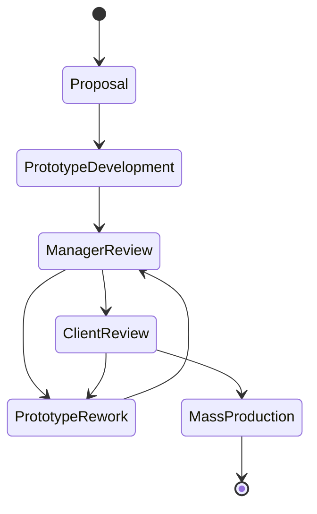

# cse608-assignments
* Assignment 1 [planetuml link](http://www.plantuml.com/plantuml/uml/VPBTxjiW3CNlUGghztc5gLkhIPCsQLgxwya19qKZWB3fb7sy-o2XQNFplygn_JkAEN1amIHvSihH8201aXrl0iOcqcA3LmgrX0JVcH8WGoxVH-_aB7cfNUsKYgX_uaXm4Ho6skGg_YY0bJvyJS5aBV05VU7IeJBJDZuJsz6lFp5FqpN4DceE2V5bVCeiOIgk2wMxrRGWcf_0XyniFJ43UdGpoqBqgFvj2r_3_76XPwZRPYQDJ73u74Rh5pp_S5Mhr-abzvCLY2d4mEWQnt47dUdkGhH-1BbHOybK8K7cICrbzgvlTBVqwsrBsbjAjjbe0f0mSqEYx91FNYYX5a1lO2I1WSZq9OE6ZyCEVr_Z-atGvpM_Hc5Ve1BUShdGrLVJ_NstFWljeCjnArMzAkXgRPIghL9iMHPwBJbkigoWUPCFVmkeoNggQPKbWnvNMTOwaZTvSly1) 
* Assignment1 [online word report](https://engasuedu-my.sharepoint.com/:w:/g/personal/2101398_eng_asu_edu_eg/EW6_-ZXMwapFrVV4nNACJHMBJjRv74BawB33d8nUSPfVcA?e=F5bwLm)

# Assignment 1 Description  (Thanks to ALLAH)[DONE]
A factory produces kids toys. the process of production depending on **getting a proposal** and **developing a prototype** and finally **produce the toys** and **getting feedback from the client**. **a top designer do the proposed prototype**. that usually **reviewed by a product manager**. **The business of the factory business needs to be automated** and also **the amount of sales and feedback related to toys needs analysis** and **Business analytics**.

* The toy factory has:
1. number of toy designers. 
2. product managers.
3. customer service who interact with client to propose toys and get feedback.

## Requirements:
1. create a detailed USE case diagram and make all possible assumptions

2. write the detailed use case description for two use cases 

3. create a at least 10 INVEST user stories, and put them in a diagram value-vs-difficulty

* **provide neat diagrams and make reasonable assumptions**

4. work in a team of two or individuals.

## Project State Diagram

# Assignment 2
## [Usecases link](http://www.plantuml.com/plantuml/uml/RLDDZnCn3BtdLrYzSEe_uB2m8420X8IMQ-LDt3HgFaQnGwc0_yuaqybEbZsCb7b-By-oN-vOC4i9Ndaw2aY2xEn9mBXCMboAIg6MbE61AGCo5AQi9jHdj0IxTyYdnvJHj3hlAiFC6FnM08jmzrsAeIYjnilvgNYVIcQ2Jv4bbmerckk_cskkB1JWZGakDXBMa_ghUZVlJVc0WPftOTB81BiloS9DK0u-sLcYjlNgZDw3d0YMPbunM0nqapXjVnrug_ZcyLhfMzPaHyuFHnS8LvXoifcORxIVuIMUNcOGK2Wxz9siUIH_ZgbT6XmBdcdbdKCOUMy9yD5JNUQ4CmeOpMmInSL2_tMkQqjR-SDaK1OEiA3jHiNomMsPNrDqTJUPk7XXICTrmQiavFHCSvz2AD7fQd5nSdgkq9Sg65pGHPa_u2K1nn9RCj4xkQu-V3pWLlGHe_446Az0EQVS8eLH_Aeu8Ra3LYC5DKGrr_3wpxvC-vRW6xBVRs9pQxM2FHW3Dja1wHiV8SqZr7UumVfYrDDRcF6-XH7jWnxXFatLtieCzL5re4_YZg8fmVy3)

## [ClassDiagram link](https://mermaid.live/edit#eyJjb2RlIjoiY2xhc3NEaWFncmFtXG5cblVzZXIgPHwtLSBTdHVkZW50XG5Vc2VyIDx8LS0gSW5zdHJ1Y3RvclxuVXNlciA8fC0tIEFkbWluXG5cblVzZXIgXCIxXCItLVwiMVwiIFZpZXdcblxuU3R1ZGVudCBcIjFcIi0tXCIxXCIgR2FtZVZpZXdcblxuR2FtZUNvbnRyb2xsZXIgXCIxXCItLVwiMVwiIEdhbWVWaWV3XG5cbkNvbnRyb2xsZXIgPHwtLSBHYW1lQ29udHJvbGxlclxuQ29udHJvbGxlciA8fC0tIERhc2hib2FyZENvbnRyb2xsZXJcblxuRGFzaGJvYXJkQ29udHJvbGxlciBcIjFcIi0tXCIxXCIgVmlld1xuQ29udHJvbGxlciBcIjFcIi0tXCIxXCIgTG9naW5Gb3JtXG5Db250cm9sbGVyIFwiMVwiLS1cIipcIiBEYXRhRWxlbWVudFxuRGF0YUVsZW1lbnQgPHwtLSBDb3Vyc2VcblxuQ291cnNlIFwiMVwiLS1cIipcIiBTdGFnZVxuU3RhZ2VNYXRlcmlhbCBcIipcIi0tXCIxXCIgU3RhZ2VcblB1enpsZXMgXCIqXCItLVwiMVwiIFN0YWdlXG5cblVzZXJJbmZvIDx8LS0gU3R1ZGVudEluZm9cblVzZXJJbmZvIDx8LS0gSW5zdHJ1Y3RvckluZm9cblVzZXJJbmZvIDx8LS0gQWRtaW5JbmZvXG5cbkRhdGFiYXNlIFwiMVwiLS1cIipcIiBEYXRhRWxlbWVudFxuRGF0YUVsZW1lbnQgPHwtLSBTdGFnZU1hdGVyaWFsXG5EYXRhRWxlbWVudCA8fC0tIFB1enpsZXNcbkRhdGFFbGVtZW50IDx8LS0gVXNlckluZm9cblxuY2xhc3MgVXNlcntcbitpbnQgaWRcbitTdHJpbmcgbmFtZVxuK1N0cmluZyB0eXBlXG59XG5cbmNsYXNzIFN0dWRlbnR7XG4raW50IHN0YWdlXG4raW50IGxldmVsXG4rc3RhcnRTdGFydEdhbWUoKVxuK2NvbnRpbnVlRnJvbWxhc3RDaGVja3BvaW50KClcbn1cblxuY2xhc3MgSW5zdHJ1Y3RvcntcbitTdHJpbmcgY291cnNlXG4rc2VuZE1lc3NhZ2VUb1N0dWRlbnQoKVxuK2FwcHJvdmVZZWFyTWFya3MoKVxuK2VkaXRDb3Vyc2VDb250ZW50KClcbn1cblxuY2xhc3MgQWRtaW57XG4raW50IGFjdGl2ZV90aWNrZXRfaWRcbittYW5hZ2UoKVxuK2F1dGhlbnRpY2F0ZSgpXG59XG5cbmNsYXNzIExvZ2luRm9ybXtcbitTdHJpbmcgZW50ZXJlZElEXG4rU3RyaW5nIGVudGVyZWRQYXNzd29yZFxuK2xvZ2luKClcbitmb3Jnb3RQYXNzd29yZCgpXG59XG5cbmNsYXNzIFZpZXd7XG4rU3RyaW5nIGNzc1N0eWxlXG4rU3RyaW5nIEhUTUxGb3JtXG4rc2VuZENyZWRlbmR0aWFsc1RvQ29udHJvbGxlcigpXG59XG5cbmNsYXNzIERhc2hib2FyZENvbnRyb2xsZXJ7XG4rdmFsaWRhdGVEYXRhKClcbityZW5kZXIoKVxufVxuXG5jbGFzcyBHYW1lQ29udHJvbGxlcntcbitjb3Vyc2Vfb2JqZWN0XG4rc3RhZ2Vfb2JqZWN0XG4rc3RhZ2VNYXRlcmlhbHNfb2JqZWN0XG4rcHV6emxlX29iamVjdFxuK2dldFN0YWdlT2JqZWN0KClcbitnZXRTdGFnZU1hdGVyaWFsT2JqZWN0KClcbitnZXRQdXp6bGVPYmplY3QoKVxuK3N0YXJ0R2FtZSgpXG4rcGF1c2UoKVxuK3NvbHZlUHV6emxlKGFuc3dlcilcbitjYXB0dXJlX2FjdGlvbigpXG4rbG9hZEZpZ3VyZXMoKVxufVxuXG5jbGFzcyBVc2VySW5mb3tcbitpbnQgYWdlXG59XG5cbmNsYXNzIFN0dWRlbnRJbmZve1xuK2ludCBhZ2VcbitnZXRDb3Vyc2VDb2RlKClcbit1cGRhdFNjb3JlKHB1enpsZV9pZCwgc2NvcmUpXG4rTXVsdGlweVNjb3JlQnlEZWNheWluZ0ZhY3RvcihwdXp6bGVfaWQpXG4rbmV4dFN0YWdlKClcbn1cblxuXG5jbGFzcyBJbnN0cnVjdG9ySW5mb3tcbitpbnQgYWdlXG59XG5cblxuY2xhc3MgQWRtaW5JbmZve1xuK2ludCBhZ2Vcbn1cblxuY2xhc3MgQ291cnNle1xuK2NvdXJzZV9jb2RlXG4rTmFtZVxuK3N0YWdlX29iamVjdFxuK3N0YWdlTWF0ZXJpYWxzX29iamVjdFxuK3B1enpsZV9vYmplY3RcbitjcmVhdGVTdGFnZU9iamVjdChzdGFnZV9pZClcbitjcmVhdGVQdXp6bGVPYmplY3QocHV6emxlX2lkKVxuK2NyZWF0ZVN0YWdlTWF0ZXJpYWxzX29iamVjdChtX2lkKVxuK2ludHJ1Y3Rvcl9jb2RlXG4rZ2V0U3RhZ2VvYmplY3Qoc3RhZ2VfaWQpXG59XG5cblxuY2xhc3MgU3RhZ2V7XG4rcHV6emxlT2JqZWN0XG4rc3RhZ2VNYXRlcmlhbHNPYmplY3RcbitnZXRQdXp6bGVPYmplY3QoKVxuK2dldFN0YWdlTWF0ZXJpYWxPYmplY3QoKVxufVxuXG5cbmNsYXNzIFN0YWdlTWF0ZXJpYWx7XG4rY291cnNlQ29udGVudFxufVxuXG5jbGFzcyBQdXp6bGVze1xuaXNDb3JyZWN0KGFuc3dlcikgXG59XG5cblxuY2xhc3MgRGF0YUVsZW1lbnR7XG4rb2JqZWN0SURcbitnZXRJRCgpXG4rZ2V0TmFtZSgpXG4rZ2V0T2plY3QoT2JqZWN0VHlwZSwgY29kZSlcbitkZWxldGUoKVxufVxuXG5jbGFzcyBEYXRhYmFzZXtcbit0YWJsZSBTdHVkZW50c1Rha2luZ0NvdXJzZVxuK3RhYmxlIGluc3RydWN0b3JzXG4rZ2V0RGF0YUVsZW1lbnRPYmplY3QoT2JqZWN0VHlwZSwgb2JqZWN0X2lkKVxuK3N0b3JlKGFsdGVyZWRfZGF0YSlcblxufVxuXG5jbGFzcyBHYW1lVmlld3tcbitzdGFnZU9iamVjdFxuK3N0YWdlTWF0ZXJpYWxzT2JqZWN0XG4rUHV6emxlT2JqZWN0XG4rZGlzcGxheUZpZ3VyZXMoKVxuK3JlbmRlcihWaWV3VHlwZSlcbittYW5ldXZlckdhbWUoKVxuK3N0YXJ0UHV6emxlKClcbityZXN0YXJ0U3RhZ2UoKVxuK3BhdXNlKClcbn1cbiIsIm1lcm1haWQiOiJ7XG4gIFwidGhlbWVcIjogXCJkZWZhdWx0XCJcbn0iLCJ1cGRhdGVFZGl0b3IiOmZhbHNlLCJhdXRvU3luYyI6dHJ1ZSwidXBkYXRlRGlhZ3JhbSI6ZmFsc2V9)

## [Sequence dashboard link](http://www.plantuml.com/plantuml/uml/bPNFRjim3CRlUWeYEzH9czDk0JPqQzTXXs85zkSo384Iivu6MJ8akKNozBCeQvEL1jPoQMrzdqZ-J57Nrd7Z-bOotZkj-dQ7Xh4BU4K_44eu8RauSYUq0lq8xXT2gskKNa8_nXQRZxp51yaFQ1O0wxS0uTLtWSyBkBpS08NnhwebIzQyDZpUQEMCbdBO8TSpbal8bqRzf1ur-HfqDxetTX3N52iNmVgbaElr1lRas-u7u_cGjzpn3n9RL2x6-xpxZNjNXJzV3ns-kGXRNLobUoxPn9tij-CMusQaGEaLbUBjp5xaX7MUMLgEfhHUZ1r0BM2r6jG6kSEn59SMaUKz3p14F8ymX8q5Vt6yYN6NBAwUfnFp84jaPFqc0w8V2QChUad__Zpb5GDHugICUSVc3qY4Qa3XCuH5g5Qh9RJ8bHs9qM8y24ds589gI_bEYytrEQxJr799OgJpH9OTDa9jduR7RSqTPzFpbXqSSZJ3Ox1Pzg_-RX3uydb88bRf1VIBBo0K0IrtQ0INTbp8ne8Fd0s5bYlidz0KpWMO7F3xCLpIEuHtla5ZeX5h4TNSkzFaBMCR2_Ku3QeQ3TQCvIIXwuz7IQ3B-D6Gt9BhV_WzaA6SsvXNEQxSCayfo1CsaSo4ZzNooIDCE14egNK7hy5HzsMgMOgany2auie-evb7EMCycNb15Mp2tcXZFFjeujBvpNgwOuM5VLXd012zvpuFU7e7jAGjkoOttxhQpw8X2bRZTnBradR8nVaSXerrtiQbyz-91ioIeRG8pXo0Dq91STfAatIsdqWSMgEQz5MQStbpaOaD3oVdxuuBYRNl9D6Y1Q4cdSOQe_iE7YSYLexzlfTET0VY_lvmYtiQhtTyFn3DlaDgBli4HHmt1cbaq7aVJluSl75wZIwi2ThvYvssZLVrEsj5e_nDROjc3F-hZqEZA4peija8S3gJheTY-bR-0G00)

## [Sequence game link](https://plantuml.io/plantuml/uml/dLTHRzis47xdhxXw3v7J61ZGDm4UkgNhq8TW0RBjPHW2shgut2XI8Aacpg-VxsYY5q8Lr0We6flVnxlxlkDHVX-J3cdihOh_6JVee7lezTCDngWFU6UU4TxzgFIOl1lx7GQbBk07Vi0uaupLvbaduntu1qYV4NhVeIK8FsgxXTzqZ_29mDeMy7QhrAgzIsE7Bgq0DZy1h5f2_cNmSGLltxR0cT5NpLg9DSBcZzVUfU2jnR2gyKhLaCmh8J-v1y-a0wPhFuPuGdOva4J0PYhOPjF2dadt-nFhsy4-wAH_jTYZIoNOxxj_SP-Q_DyVnm6t5tchYokv9oKYs6A_dOvODcC4Ma8qJlVpUsKcREhCP3cUqyfuBEjdIfPf1PUN9tX0dGgyIRACDTIfpsWeWwgBqZHmb_G1uTRget47wYNnAElz04FmUyIEbXaSgT4oRSWqQh5fNqefHKMcdNs9zFUzwTQgeEQavmgdBALjo8M_XGrNPUz_f26LkYGBuOGgkVuiETNby17o8ZINbsleKRkObv4MYrwo0Wx1TKh_fWkNl6ddwXHh21FbSIPAGDTXQ2IJOibpBGyeSmuqENPuC2wghqeKWtLE0qgzAhV6RTKQ9nu_1GUvEkXrmc2qZUS5CO_8ydeQzThX-0N3me44ihbkpg6oriokuS8XejRCAAWPLHWIL9ahLfer2EQyhKMOukyYUxdH1NVdYRl4to8i6PQR13kbAjTW69-VBNczn2k-2UwPyZrUtJ9XcKcJbCgSl4YcG9jDcO3FEv9hMEw4f2mm86E5x4LrgJr4Rx-St14UY4dy3X9tM8MQTuZ1PpKQxU8ZXWKspHCbKihFD1ElVGYaUY5fcsYpaLz7J8HzNeS6dqm2Acsj043iCsaIa8n7Z8nTyCxH_ZbqT3fFuR0vMsMwAuZqHOae2TNr0srCHDKsaMFttMbXhT16X1IEe0_6mUAydVzMsfLbOe2_QA-SyFVr637KwKDznE6ZDXOxQYZJOmJZG3QSEWG_3l3m0gGMYdupscI68wl-o_43xla6-QZtoPUA-EvxdVgB96m3qbZYiKv3QLQtysWyKx1ZlSe_4gv8Pfo9d-5dQs5VtsfdmVQ-7omcf9VpFE0Njwh39vdkAwK1pZO_q27bGcCYDr2vV6TpgkwuDs_Ql4_9Q_RyByTJd1e-9VgWnvZbP9F4BvtRbolRxSmKR7cVfRzj2dQ9RJ1bn98p3byFEOLZqdo3CgvJxq-iiRV_0m00)

## [state game link](https://plantuml.io/plantuml/uml/VLBDJW8n4BxFKypPX1VemO14ZGTbemSEniDa6POcfKiw0oZ6TxVjigGhu9uwty_NcUsCHIdeTktW_UO3HwDRd2sNpde6E1uoEAdLxjZWRCCU6rf7keDAYy6fQuNF-JUbXYj7NzOt1gl08WaB2l4J9UM11B_XrCrZpCfSfn-MMN4qpQskClDCoi6I4uDFFXwfrfIvZppggk_kgYjdtd5ZVRKz71mRV6MgLvmoDXa1AEXkljRj8jyR9bxs77frGLwMpqCRiocRpjJ_pZTjG-1Qhtk7lylW_MVDl13K7731y62zbUuUWnM9H1h9kUCm0eKW6VvUyC9xb5J33vHFEbYYYhRzbfoBfkrwurWv9PjJbNl8mG9GIefW6BDVn4t-1G00)

**It is required to build a software application in one of the following domains:**

## 3. Virtual Reality Educational Game
* Virtual Reality Educational game based on topics from one course,
* students have **levels** 
* The course is divided into stages 
* Each student must complete all stages before he proceed to the final stage
* The course stages can be edited and updated by course instructors

## Team members
In teams of 1/2/3 create the following

## Requirements

1. userstories
2. functional and non functional requirements 
3. list all stakeholders
4. use case diagram
4. provide use case description for at least **two use cases**
5. create all required development uml models like:
* class diagram 
* time sequence diagram 
* state diagram
6. provide short research about the main system users UX 
* and design at least two UI screens

## What to hand
1. A word document containing all text diagrams, models and 
2. A presentation in ppt.pptx similar to the library case study
3. Possibly use draw.io for your **diagrams either copy and past or have link for the diagram in your word document**
