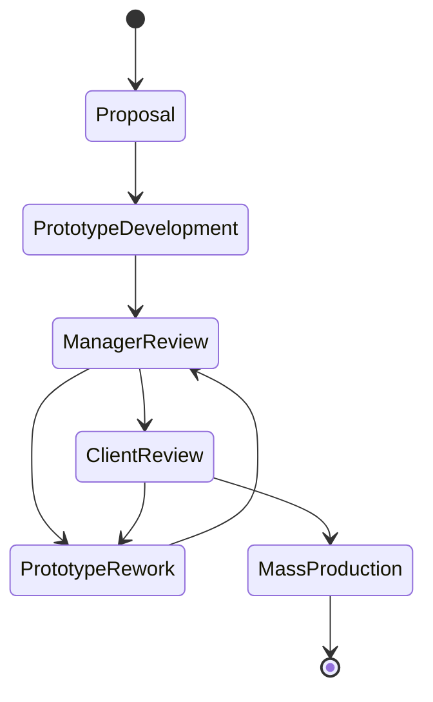

# cse608-assignments
* Assignment 1 [planetuml link](http://www.plantuml.com/plantuml/uml/VPBTxjiW3CNlUGghztc5gLkhIPCsQLgxwya19qKZWB3fb7sy-o2XQNFplygn_JkAEN1amIHvSihH8201aXrl0iOcqcA3LmgrX0JVcH8WGoxVH-_aB7cfNUsKYgX_uaXm4Ho6skGg_YY0bJvyJS5aBV05VU7IeJBJDZuJsz6lFp5FqpN4DceE2V5bVCeiOIgk2wMxrRGWcf_0XyniFJ43UdGpoqBqgFvj2r_3_76XPwZRPYQDJ73u74Rh5pp_S5Mhr-abzvCLY2d4mEWQnt47dUdkGhH-1BbHOybK8K7cICrbzgvlTBVqwsrBsbjAjjbe0f0mSqEYx91FNYYX5a1lO2I1WSZq9OE6ZyCEVr_Z-atGvpM_Hc5Ve1BUShdGrLVJ_NstFWljeCjnArMzAkXgRPIghL9iMHPwBJbkigoWUPCFVmkeoNggQPKbWnvNMTOwaZTvSly1) 
* Assignment1 [online word report](https://engasuedu-my.sharepoint.com/:w:/g/personal/2101398_eng_asu_edu_eg/EW6_-ZXMwapFrVV4nNACJHMBJjRv74BawB33d8nUSPfVcA?e=F5bwLm)

# Assignment 1 Description  (Thanks to ALLAH)[DONE]
A factory produces kids toys. the process of production depending on **getting a proposal** and **developing a prototype** and finally **produce the toys** and **getting feedback from the client**. **a top designer do the proposed prototype**. that usually **reviewed by a product manager**. **The business of the factory business needs to be automated** and also **the amount of sales and feedback related to toys needs analysis** and **Business analytics**.

* The toy factory has:
1. number of toy designers. 
2. product managers.
3. customer service who interact with client to propose toys and get feedback.

## Requirements:
1. create a detailed USE case diagram and make all possible assumptions

2. write the detailed use case description for two use cases 

3. create a at least 10 INVEST user stories, and put them in a diagram value-vs-difficulty

* **provide neat diagrams and make reasonable assumptions**

4. work in a team of two or individuals.

## Project State Diagram

## [Sequence dashboard link](http://www.plantuml.com/plantuml/uml/bPNFRjim3CRlUWeYEzH9czDk0JPqQzTXXs85zkSo384Iivu6MJ8akKNozBCeQvEL1jPoQMrzdqZ-J57Nrd7Z-bOotZkj-dQ7Xh4BU4K_44eu8RauSYUq0lq8xXT2gskKNa8_nXQRZxp51yaFQ1O0wxS0uTLtWSyBkBpS08NnhwebIzQyDZpUQEMCbdBO8TSpbal8bqRzf1ur-HfqDxetTX3N52iNmVgbaElr1lRas-u7u_cGjzpn3n9RL2x6-xpxZNjNXJzV3ns-kGXRNLobUoxPn9tij-CMusQaGEaLbUBjp5xaX7MUMLgEfhHUZ1r0BM2r6jG6kSEn59SMaUKz3p14F8ymX8q5Vt6yYN6NBAwUfnFp84jaPFqc0w8V2QChUad__Zpb5GDHugICUSVc3qY4Qa3XCuH5g5Qh9RJ8bHs9qM8y24ds589gI_bEYytrEQxJr799OgJpH9OTDa9jduR7RSqTPzFpbXqSSZJ3Ox1Pzg_-RX3uydb88bRf1VIBBo0K0IrtQ0INTbp8ne8Fd0s5bYlidz0KpWMO7F3xCLpIEuHtla5ZeX5h4TNSkzFaBMCR2_Ku3QeQ3TQCvIIXwuz7IQ3B-D6Gt9BhV_WzaA6SsvXNEQxSCayfo1CsaSo4ZzNooIDCE14egNK7hy5HzsMgMOgany2auie-evb7EMCycNb15Mp2tcXZFFjeujBvpNgwOuM5VLXd012zvpuFU7e7jAGjkoOttxhQpw8X2bRZTnBradR8nVaSXerrtiQbyz-91ioIeRG8pXo0Dq91STfAatIsdqWSMgEQz5MQStbpaOaD3oVdxuuBYRNl9D6Y1Q4cdSOQe_iE7YSYLexzlfTET0VY_lvmYtiQhtTyFn3DlaDgBli4HHmt1cbaq7aVJluSl75wZIwi2ThvYvssZLVrEsj5e_nDROjc3F-hZqEZA4peija8S3gJheTY-bR-0G00)

## [Sequence game link](http://www.plantuml.com/plantuml/uml/dLV1Rjms4BtpAoQRWoN7FlKcG4LQfobo26eWRIz5ON2byOO5HGea5MVzzTqPKZMbxWfC10GnTjxZpBmt7Es-zK6wC0rQo2bOCmrxT49SmMj-G1aLb9RgMGPb3TX729yH1jkZ9WW_ectXLpaWV22mr3EuRONODP_2rAC9Eu3R7m5s3I7_LFYqWpTl6k3iz55LYonsmYRedJN1MQtHxTPu8TQGn4ifFvX7owG3XZixENz2zaHS8k3sNBBRsmOw9Zrq9zRbPEzaaBze7AZ7bEot_J_OXIh-z_jnnFOg7dLravzPYmKxEsylFSw7CG8r8IeZXysp4XDkrvNbxLWkQvbxMuIC9Qvcr-5Ja0U4UosFoXpWzU8HsjeHHcSxn9x23FOqAP4s9bhRNXGsMZRBmBGahAU_7rHVYncrfHrtUCuJEePa_2lJyMO---zpYgPa90lXCbKWQj8vb87wClW4CGZLzNKD0qhZOnWvc8JAE-0KtESEhg-RX3xVUCQxwDoon3M4YVbz98f3qwEhScOjbXSpls7CET3Lt-D16IzUb9WDbh6C__eLSJJkLwDnuiKduI1s1uCCw9JKFWNoXPANdzR980rENz0LRXJ8X-jZIfMqhY_D9OEPkcRwZ9fGYP63bkRcaQg6ZBbjwonCSgdCNXxqZBktn2tnTnQM38j3WhqGAzTWd9wVDNbTuXMlyWUcV8jNzqmeC-aI9JSd1iaKQA8fItY18x67SYToIe414Pl9dbHVQk-j_aBk9FHo4_y0WITiXTfsYC59ZKeQ_uIkmAPjOexCvMUQydVMEL9z9aaTwB29lqye3rsCGuLVLG1ghHO0C9zpoIGW6O_e6LlmfQ7vO-pfTfxIOPMiKlqDUFeWPSm9wzSFD3uGLUf0ZZtqfq0jK7k4u8uW3yf0STt6NYfxPLcsm1VZbGh-fXaZXa3J_--AlvTAOqy3fGRqeCnYuCJ1sMc4nmL858h-ST91ZKTM_UVZE-pu3V9UTi6w5nTgyNtg5qdOEEIrn3U-giMcRcar9WhshDVyZuIR9LD6-S_mazRGhTzgIR3E3gF6WFpjcXTyyQWQ_9gL-xtIGAgM7kYHQg4r4GV8fzXsJSjttAjNJJedrRLv_ylnb6SDFoVwA2VFSaQJifygzyj8ssvimORFAVjnac4BR8DpHfJSSNYvv9IEITi3ohXUl3snfa7_2m00)

**It is required to build a software application in one of the following domains:**

## 3. Virtual Reality Educational Game
* Virtual Reality Educational game based on topics from one course,
* students have **levels** 
* The course is divided into stages 
* Each student must complete all stages before he proceed to the final stage
* The course stages can be edited and updated by course instructors

## Team members
In teams of 1/2/3 create the following

## Requirements

1. userstories
2. functional and non functional requirements 
3. list all stakeholders
4. use case diagram
4. provide use case description for at least **two use cases**
5. create all required development uml models like:
* class diagram 
* time sequence diagram 
* state diagram
6. provide short research about the main system users UX 
* and design at least two UI screens

## What to hand
1. A word document containing all text diagrams, models and 
2. A presentation in ppt.pptx similar to the library case study
3. Possibly use draw.io for your **diagrams either copy and past or have link for the diagram in your word document**
